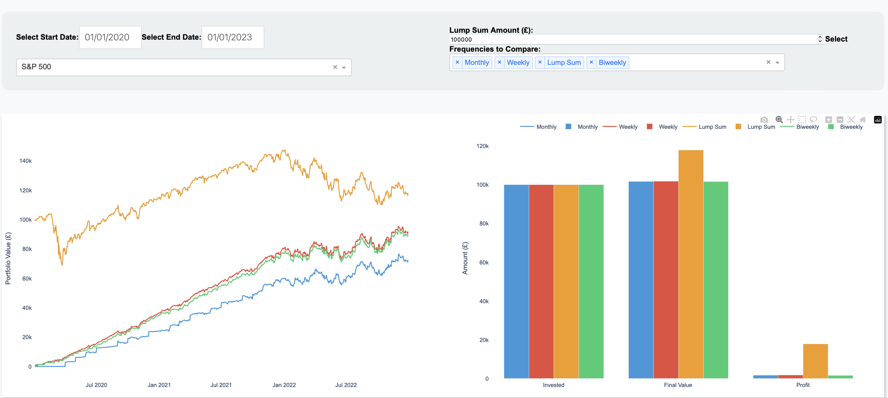

# Dollar-Cost Averaging Strategies Dashboard

This dashboard provides a visual comparison of various dollar-cost averaging (DCA) strategies. It showcases the growth of a portfolio and returns based on different investment strategies, such as lump sum investing, weekly, biweekly, and monthly contributions. Users can also customize the initial investment amount and choose different funds or stocks for their investment.

## Features

- **Interactive Visualization**: View the portfolio's growth over time based on chosen strategies.
- **Multiple Investment Frequencies**: Compare lump sum, weekly, biweekly, and monthly investment strategies.
- **Customizable Initial Amount**: Set a preferred starting investment amount.
- **Wide Selection of Funds/Stocks**: Choose from a variety of index funds, stocks, and other investment options.

## Installation & Setup
1. **Clone the Repository:** `git clone https://github.com/muntazirabidi/dollar_cost_averaging.git`
2. **Navigate to the Directory:**  `cd YourFolder`
3. **Install the Required Packages:** `pip install -r requirements.txt`
4. **Run the App:** `python app.py`

## File Structure

app.py: This file initiates the Dash application.
layout.py: Defines the layout and design of the dashboard.
data_utils.py: Contains utility functions to process and manipulate data.

## Built With

**Dash** - A productive Python framework for building web applications.
**Python** - A versatile programming language.

## Contributing

Contributions are always welcome! Please read the contribution guidelines first.
